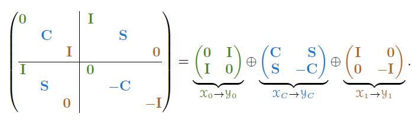
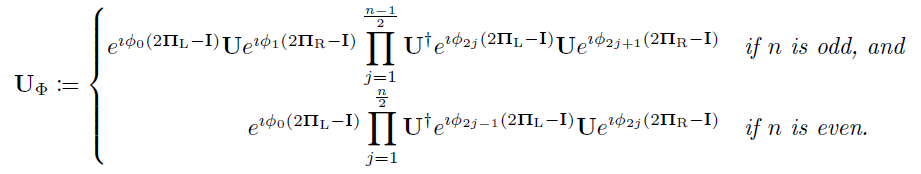
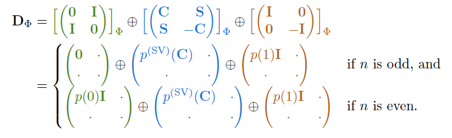

# Notes on 'A CS guide to the quantum singular value transform'

This paper offers two key results. First, it offers an alternative proof for how quantum signal processing on two dimensions can be lifted to QSVT. Second, it suggests that the bounded polynomial approximations used in the original QSVT paper to approximate transformations for various applications can all be viewed (or nearly viewed) as truncations of a Chebyshev series which is defined [here](https://en.wikipedia.org/wiki/Chebyshev_polynomials). They claim their approach offers a simpler framework for deriving polynomial approximations and in some regimes gives logarithmic speedups. Finally, the paper gives a variation of a proof that lower bounds the degree required for polynomial approximations for a bounded  $`\exp`$  function. These notes will mainly be focused on the first result.

## CS decomposition

The foundational theorem used by the author is the CS decomposition theorem which says that for a unitary matrix that has been parititoned into 2x2 many blocks of size  $`\{r_1, c_1\} \times \{r_2, c_2\}`$ 


```math
U = 
\begin{pmatrix}
U_{11} & U_{12}\\
U_{21} & U_{22}
\end{pmatrix}
=
VDW^\dag=
\begin{pmatrix}
V_1 & 0\\
0 & V_2
\end{pmatrix}
\begin{pmatrix}
D_{11} & D_{12} \\
D_{21} & D_{22}
\end{pmatrix}
\begin{pmatrix}
W_1 & 0\\
0 & W_2
\end{pmatrix}^\dag
```


where  $`V, D, W, V_{i}`$  and  $`W_{i}`$  are unitary and each  $`D_{ij}`$  is a diagonal matrix. The final equality is achieved by taking a singular value decomposition of  $`U_{11}`$  to produce matrices  $`V_1, D_{11}`$  and  $`W_1`$  as defined above. Then by taking the QR decomposition* of  $`U_{21}W_1`$  and symmetrically  $`U_{12}^\dag V_1`$  we get two upper triagular matrices  $`D_{21}`$  and  $`D_{12}`$  such that


```math
U_{21}W_{1} = V_2D_{21} \implies U_{21} = V_2D_{21}W_1^\dag\\
U_{12}^\dag V_1 = D_{12}^\dag W_2 \rightarrow U_{12} = V_1D_{12}W_2^\dag 
```

Finally,  $`D_{22} = V_2^\dag U_{22} W_2`$ . The paper then shows that each  $`D_{ii}`$  is a diagonal matrix, but, more saliently, shows the matrix  $`D`$  takes the form
\
Where  $`C`$  and  $`S`$  are diagonal matrices with  $`0 < C_{ii}, S_{ii} < 1`$  and that satisfy  $`C^2 + S^2 = I`$ ;  $`I`$  is the identity; and  $`0`$  and blanks are used interchangeably to represent the zero matrix. The layout of  $`D_{11}`$  in the LHS is given by the fact it is the diagonal matrix in the SVD of  $`U_{11}`$  with singular values arranged in increasing order. The layout of the the remaining blocks are implied by the fact that the rows and columns of  $`D`$  are orthonormal and each  $`D_{ii}`$  is an upper triangle.

Another salient observation is the decomposition of  $`D`$  into the direct sum of three unitary operators shown on the RHS of the above image. This representation confused me a little to begin with because, from my understanding of diret sums

```math
A\oplus B = 
\begin{pmatrix}
A & 0 \\
0 & B
\end{pmatrix}
```


which, when applied to the RHS term, produces a matrix that does exactly equal the LHS. But, then I realised it does equal the LHS up to a reordering of the basis. Namely, if the RHS matrix (produced according to my naive understanding of direct sums above) is written with respect to input and output basis  $`(B_1, B_2 ... B_6)`$  (note each  $`B_i`$  is a basis set since each element of  $`D`$  is a block) then the LHS is equal to this matrix with respect to an input/out basis  $`(B_1, B_4, B_2, B_5, B_3, B_6)`$ .


\* The QR decomposition says that a general  $`m\times n`$  complex matrix  $`A`$  can be decomposed  $`A = QR`$  where  $`Q`$  is  $`m\times m`$  unitary and  $`R`$  is an  $`m\times n`$  upper right triangular matrix (all elements below the main diagonal are zero).

## Definitions

This section is dedicated to definitions, remarks and theorems all to be utilised in proofs in the next section. 

The first definition took me some time to wrap my head around, but I now understand it to be a generalisation of the block encoded unitary presented in [Grand Unification of Quantum Algorithms](MRTC.md). 

In essence, unitary  $`U \in \mathbb{C}^{n\times n}`$ , is a block encoding of  $`A \in \mathbb{C}^{r\times c}`$ , if there exists an input an output basis on which the matrix representation of  $`U`$  contains  $`A`$  in its top left block. Define  $`B_R, B_L \in \mathbb{C}^{n\times n}`$  to be unitary matrices composed of this input and output basis respectively. By definition


```math
\begin{align}
B_L^\dag UB_R = 
\begin{pmatrix}
A & \cdot\\
\cdot & \cdot
\end{pmatrix} ^ *
\end{align} 
```


Now define  $`B_R = (B_{R,1}, B_{R,2})`$  to be a vertical partition of  $`B_R`$  so that  $`B_{R,1}\in \mathbb{C}^{n\times c}`$  and similarly for  $`B_L`$  to get  $`B_{L,1} \in \mathbb{C}^{n\times r}`$ . From the above its clear that  $`B_{L,1}^\dag U B_{R,1} = A`$ . Further we can define  $`\Pi_L = B_{L,1}B_{L,1}^\dag`$  and  $`\Pi_R  = B_{R,1}B_{R,1}^\dag`$  which are orthogonal projectors to the space spanned by the columns of  $`B_{L,1}`$  and  $`B_{R,1}`$  respectively. 

To put things in perspective, in the Grand Unification of Quantum Algorithms, we restricted ourselves to considering 


```math
\begin{align}
B_R = (\ket{0}\bra{0} + \ket{1}\bra{1})\otimes \sum_k \ket{v_k}\bra{v_k}\\
B_L = (\ket{0}\bra{0} + \ket{1}\bra{1})\otimes \sum_k \ket{w_k}\bra{w_k}\\
B_{R,1} = \Pi_R =\ket{0}\bra{0}\otimes \sum_k \ket{v_k}\bra{v_k}\\
B_{L,1} = \Pi_L = \ket{0}\bra{0}\otimes \sum_k \ket{w_k}\bra{w_k}
\end{align}
```

where  $`\ket{v_k}`$  and  $`\ket{w_k}`$  are the columns of the unitaries in the singular value decomposition of  $`A`$  and the number of columns in  $`B_{R,1}`$  is half that of  $`B_R`$  (same for  $`B_{L,1}`$ ). This necessitated the encoding.

```math
U = 
\begin{pmatrix}
A & \sqrt{I - A}\\
\sqrt{I-A} & -A
\end{pmatrix}
```


The remainder of this section defines QSP for the two dimensional case and the set of polynomials achievable by this algorithm. Interestingly, the set of QSP achievable polynomials is characterised differently to how I usually see it. It says that there exists a QSP-achievable polynomial  $`p \in \mathbb{C}[x]`$  whose real component is given by  $`p_{\mathcal{R}}\in \text{Re}(p)`$  and that is achievable by a tuple of phases  $`\vec{\phi} \in \mathbb{R}^{n+1}`$  if and only if  $`p_{\mathcal{R}}`$  is even or odd and its absolute value is at most one for  $`x\in [-1,1]`$ . 

The section also defines the phase alternating sequence used to generate  $`U_\phi`$  in QSVT, exponentiating reflections  $`2\Pi_L -I`$  and  $`2\Pi_R - I`$  in the usual way.\

The final theorem states in the section gives the promise of QSVT - the phase alternating sequence defined earlier gives a QSP-achievable polynomial transformation of the singular values of  $`U`$ .

\* As an exercise to see why, take an arbitrary matrix  $`A \in \mathbb{C}^{2\times 2}`$  defined on any input/output basis you like (for simplicity both can be the computational basis) and define

```math
U_Y = \frac{1}{\sqrt{2}}
\begin{pmatrix}
1 & 1\\
i & -i
\end{pmatrix}
```


which is the matrix composed of eigenvectors of  $`Y`$  as columns. Its not difficult to show that for input  $`\ket{\psi}`$  defined in the input basis of  $`A`$ ,  $`U_Y^\dag A\ket{\psi}`$  gives  $`A\ket{\psi}`$  in the  $`Y`$  basis. Similarly, for input  $`\ket{\psi}`$  defined in the  $`Y`$  basis,  $`AU_Y\ket{\psi}`$  gives  $`A\ket{\psi'}`$  in the output basis of  $`A`$ , where  $`\ket{\psi'}`$  is  $`\ket{\psi}`$  in the input basis of  $`A`$ . 

## Proof

The steps of the proof are as follows:
First assume that  $`U`$  is written in the correct basis, that is, for  $`B_{L, 1} = B_{R, 1} = I`$ , 

```math
U =
\begin{pmatrix}
A & \cdot \\
\cdot & \cdot
\end{pmatrix}
```
 
Next, show that the unitaries  $`V, W`$  produced by the CS decomposition,  $`U = VDW^\dag`$ , commute with the phase operators  $`e^{i\phi(2\Pi_L - I)}`$  and  $`e^{i\phi(2\Pi_R - I)}`$ .

Then, show that this implies  $`U_\phi = VD_\phi W^\dag`$  when  $`d`$  is even and  $`U_\phi = WD_\phi W^\dag`$  when  $`d`$  is odd since the intermediate  $`V`$  and  $`W`$  cancel out with their adjoint.

Next show that the phase opertor can be decomposed into the direct sum of three operators in the same way that  $`D`$  can,

```math
e^{i\phi(2\Pi_L - I)} = 
\begin{pmatrix}
e^{i\phi}I & 0\\
0 & e^{-i\phi}I
\end{pmatrix}
=
\begin{pmatrix}
e^{i\phi}I & 0\\
0 & e^{-i\phi}I
\end{pmatrix}
\oplus 
\begin{pmatrix}
e^{i\phi}I & 0\\
0 & e^{-i\phi}I
\end{pmatrix}
\oplus 
\begin{pmatrix}
e^{i\phi}I & 0\\
0 & e^{-i\phi}I
\end{pmatrix}
```

where the operators in the direct sum interact with the  $`y_0, y_C`$  and  $`y_1`$  subspaces defined in the first image attached to these notes. Similarly  $`e^{i\phi(2\Pi_R-I)}`$  gives a direct sum decomposition that interacts with  $`x_0, x_C`$  and   $`x_1`$  respectively. Therefore  $`D_\phi`$  further simplifies to 

```math
D_\phi = 
\begin{pmatrix}
0 & I\\
I & 0
\end{pmatrix}_{\phi}
\oplus
\begin{pmatrix}
C & S\\
S & -C
\end{pmatrix}_\phi
\oplus
\begin{pmatrix}
I & 0\\
0 & I
\end{pmatrix}_\phi
```


The penultimate step of the proof is to then show that each QSP applied to each of the matrices generates the corresponding polynomial applied to the top left element.\

Where the distinction between odd and even  $`n`$  (which determines the parity of the degree of  $`p`$ ) comes from the fact that, by the conditions of  $`QSP`$ -achievability,  $`p(0)=0`$  for odd  $`n`$  and  $`p(0) = e^{i\sum_{k=0}^n(-1)^k \phi_k}`$  for even  $`n`$ .

The final step of the proof is to then generalise  $`U`$  to the case where  $`B_{L, 1}`$  and  $`B_{R,1}`$  are not necessarily the identity. If we denote  $`U`$  to be a block encoding of  $`A`$  defined in the arbitrary basis (i.e.  $`A`$  is not necessarily a top-left submatrix of  $`U`$ ) and  $`\bar{U}`$  to be a block encoding of  $`\bar{A}`$ , which equals  $`A`$  up to a change in basis, such that  $`\bar{A}`$  appears as a top-left submatrix of  $`\bar{U}`$ . We have

```math
\bar{U} =
\begin{pmatrix}
\bar{A} & \cdot\\
\cdot & \cdot
\end{pmatrix}
= B_{L}^\dag U B_{R}

\iff
U = B_L\bar{U}B_R^\dag
```


It turns out that 


```math
U_\phi = B_L \bar{U}_\phi B_R^\dag = 
B_L
\begin{pmatrix}
\text{Poly}(\bar{A}) & \cdot \\
\cdot & \cdot
\end{pmatrix}
B_R^\dag
```


which, the authors claim, gives


```math
\begin{pmatrix}
\text{Poly}(A) & \cdot\\
\cdot & \cdot
\end{pmatrix}
```
