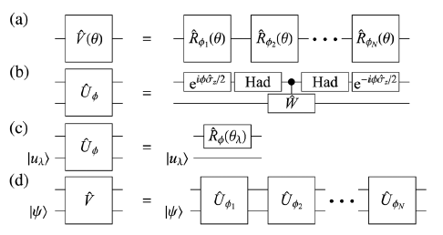

# Timeline and commentary on the development of the QSP/QSVT framework

- [2016: Single qubit QSP](#2016-single-qubit-qsp) (186 citations)
- [2016: Hamiltonian Simulation by QSP](#2016-hamiltonian-simulation-by-qsp) (943 citations)
- [2017: Multi-dimensional QSP via qubitization](#2017-multi-dimensional-qsp-via-qubitization) (1115 citations)
- [2018: Creation of QSVT](#2018-creation-of-qsvt) (866 citations)
- [2021: A pedagogical tutorial](#2021-a-pedagogical-tutorial-on-qsvt) (362 citations)
- [2023: A CS guide to QSVT](#2023-a-cs-guide-to-qsvt) (26 citations)
- [2024: Generalised QSP](#2024-generalised-qsp) (52 citations)
- [2024: Hamiltonian Simulation by Generalised QSP]()
- [2024: QSVT underperforms in QPE](#2024-qsvt-underperforms-in-qpe) (9 citations)


## 2016: Single qubit QSP
This is based on the paper "[The methodology of resonant equiangular composite quantum gates](https://arxiv.org/abs/1603.03996)" Guang Hao Low, Theodore J. Yoder and Isaac L. Chuang.

This paper marks the origins of QSP. The authors ultimately seek to characterise the the quantum response function  $`\hat{U}(\theta)`$  that can be achieved through composing  $`L`$  basic unitary operators, restricting themselves to the single qubit (two-dimensional) case. Their work is inspired by previous work in classical discrete-time signal processing and the Shinnar-LeRoux algorithm for quantum single processing restricted to the field of nuclear magentic resonance imaging (MRI).

The authors consider the set of unitaries achievable by the composition

```math
\hat{U}(\theta) = \prod_{k=1}^{L}R_{\phi_k}(\theta)
```

where  $`R_\phi (\theta) = e^{-i \theta/2 (\cos \phi X + \sin \phi Z)}`$ . They assert that, equivalently,  $`\hat{U}(\theta)`$  can be expressed

```math
\hat{U}(\theta) = A(\theta)I + iB(\theta)Z + iC(\theta)X + iD(\theta)Y
```

where  $`(A, B, C, D)`$  is a tuple of so-called achievable polynomials, meaning a sequence of phases  $`\vec{\phi} \in \mathbb{R}^k`$  generate these polynomials from the above composite of rotations. They also define partial tuple to be a tuple of four polynomials where one or more are left unspecified, e.g.  $`(A, \cdot, C, \cdot)`$ . 

Section III of the paper is dedicated to characterising achievable polynomial tuples and partial tuples; describing an efficient algorithm to determine  $`\vec{\phi}`$  for a given  $`(A, B, C, D)`$ ; describing an efficient algorithm for constructing  $`(A,B,C,D)`$  given only a partial tuple (e.g.  $`(A, \cdot, C, \cdot)`$ ); and an algorithm for computing achievable partial tuples for a given objective function. Thus the flow for implementing some objective unitary 

```math
U_o(\theta) = 
\begin{pmatrix}
f_1(\theta) & f_2(\theta)\\
f_3(\theta) & f_4(\theta)
\end{pmatrix},
```
 

where one or more of  $`f_i`$  can be left unspecified if desired, is to first generate the corresponding achievable partial tuple for which  $`\hat{U}_{\vec{\phi}}`$  best approximates  $`U_o`$ ; construct a corresponding achievable tuple; determine  $`\vec{\phi}`$  generating this tuple and implement  $`\hat{U}_{\vec{\phi}}`$  on a quantum computer.

The remainder of the paper focuses on example use cases of the above algorithm.

## 2016: Hamiltonian Simulation by QSP 
This is based on the paper "[Optimal Hamiltonian Simulation by Quantum Signal Processing](https://arxiv.org/abs/1606.02685)" by Guang Hao Low and Isaac L. Chuang.

This paper applies the methods developed in the previous section to Hamiltonian simultation, producing an algorithm to optimally approximate the time evolution operator  $`e^{-i\hat{H}t}`$  for time interval  $`t`$  with error  $`\epsilon`$ , where  $`\hat{H}`$  is a  $`d`$ -sparse Hamiltonian (each row has at most  $`d`$  many non-zero elements). Specifically, the authors achieve 


```math
O(td||\hat{H}||_{max} + \log(1/\epsilon)/\log \log(1/\epsilon))
```


complexity which is optimal in its scaling with respect to  $`t`$  (lower bounded by the no-fast-forwarding theorem) and  $`\epsilon`$  (lower bounded by another work) and is additive in each of these while the previous best known algorithm was multiplicative. 

For a Hamiltonian  $`H = \sum_\lambda \lambda\ket{\lambda}\bra{\lambda}`$ , and two input oracles which give details about the scalar elements of  $`H`$ , results from Child's quantum walk show that it is possible to efficiently build a unitary  $`T`$  whose action on  $`\ket{\lambda}`$  is


```math
T\ket{\lambda} = \frac{1}{\sqrt{2}}(\ket{\lambda +} + \ket{\lambda -})
```

producing states on the LHS that are an eigenbasis of another unitary

```math
\begin{align}
\hat{W} = \sum_\lambda e^{i\theta_{\lambda +}} \ket{\lambda +}\bra{\lambda +} + \sum_\lambda e^{i\theta_{\lambda -}} \ket{\lambda -}\bra{\lambda -}
\end{align}
```

where

```math
\begin{align}
\theta_{\lambda +} = \arcsin(\lambda/||H||_{\max}d) \\
\theta_{\lambda -} = -\arcsin(\lambda/||H||_{\max}d) + \pi.
\end{align}
```

which turns out to be easy to build given  $`\hat{T}`$ . For brevity, we will write (1) as

```math
\hat{W} = \sum_{\lambda \pm} e^{i\theta_{\lambda \pm}} \ket{\lambda \pm}\bra{\lambda \pm}.
```


It is not hard to see that

```math
\begin{align}
h(\theta_{\lambda \pm}) = -td||H||_{\max} \sin(\theta_{\lambda \pm}) = t\lambda
\end{align}
```
 

where the RHS is independent of the  $`\pm`$  index, thus, if we can well approximate the transformation


```math
\begin{align}
\hat{W} \rightarrow \hat{V} = \sum_{\lambda \pm} e^{ih(\theta_{\lambda \pm})}\ket{\lambda \pm}\bra{\lambda \pm}
\end{align}
```

then 

```math
\hat{T}^\dagger \hat{V}\hat{T} = \sum_\lambda e^{it\lambda}\ket{\lambda}\bra{\lambda}
```

gives the correct solution to Schrodinger's equation at time  $`t`$ .
Despite  $`\hat{W}`$  and  $`\hat{V}`$  not necessarily being single qubit operations, the authors show that the above transformation can be achieved by QSP, marking the first extension of QSP to the multi-dimensional case, in a technique known as qubitization, which is generalised in the next section. In what follows, the authors consider the case where we are given a general unitary 


```math
\hat{W} = \sum_\lambda e^{i\theta_\lambda}\ket{u_\lambda}\bra{u_\lambda}
```

for which we want to approximate a general transformation 

```math
\hat{W} \rightarrow \hat{V} = \sum_\lambda e^{ih(\theta_\lambda)}\ket{u_\lambda}\bra{u_\lambda}
```

and its not difficult to then relate these results back to the specific scenario of Hamiltonian simulation described in equation (5).

Helpfully, the paper includes circuit illustrations for the proposed algorithm which we'll go through now.\
\
Figure 1.b shows that we can construct  $`\hat{U}_\phi = \sum_\lambda \hat{R}_\phi (\theta_\lambda)\otimes \ket{u_\lambda}\bra{u_\lambda}`$  as follows

```math
\begin{align}
\hat{U}_\phi = e^{-i\phi Z/2}H \left(\ket{0}\bra{0} \otimes I +\ket{1}\bra{1}\otimes \hat{W}\right)He^{i\phi Z/2}\\
= e^{-i\phi Z/2}\left(\ket{+}\bra{+}\otimes I + \ket{-}\bra{-}\otimes \hat{W}\right)e^{i\phi Z/2}\\
= e^{-i\phi Z/2}\left[\sum_\lambda (\ket{+}\bra{+} + e^{i\theta_\lambda}\ket{-}\bra{-})\otimes \ket{u_\lambda}\bra{u_\lambda}\right] e^{i\phi Z/2}\\
=e^{-i\phi Z/2}\left[ \sum_\lambda e^{i\theta_\lambda/2} e^{-i\theta_\lambda X/2}\otimes \ket{u_\lambda}\bra{u_\lambda}\right]e^{i\phi Z/2}\\
=\sum_\lambda e^{i\theta_\lambda/2}R_\phi(\theta_\lambda)\otimes \ket{u_\lambda}\bra{u_\lambda}
\end{align}
```


Note (9) holds because in (8), we are exponentiating the eigenvalue decomposition of the  $`X`$  Pauli operator by  $`i\theta_\lambda/2`$  up to a global phase of  $`e^{i\theta_\lambda/2}`$ ; and (5) shows that  $`R_\phi`$ , defined in the previous section, turns out to just be a composition of  $`X`$  and  $`Z`$  rotations. Note, since we'll ultimately be doing compositions of  $`\hat{U}_{\phi_k}`$ , we can get rid of the phase factor  $`e^{i\theta_\lambda/2}`$  by instead alternating  $`\hat{U}_{\phi_j}`$  with  $`\hat{U}^\dagger_{\phi_{j+1} + \pi} = \sum_\lambda e^{-i\theta_\lambda/2}R_{\phi_{j+1}}(\theta_\lambda)\ket{u_\lambda}\bra{u_\lambda}`$ .

1.c shows that when the input state in the second register is an eigenvector  $`\ket{u_\lambda}`$  of  $`\hat{W}`$ , this has the effect of selecting the rotation  $`R_\phi(\theta_\lambda)`$  on the ancillary qubit. 1.a and 1.d shows that for an appropriate choice of phases  $`\vec{\phi} \in \mathbb{R}^n`$ , compositions of  $`\hat{U}_{\phi_k}`$ , when the input state on the second register is an eigenvector  $`\ket{u_\lambda}`$ , produces 

```math
V(\theta_\lambda) =  A(\theta_\lambda)I + iB(\theta_\lambda)Z + iC(\theta_\lambda)X + iD(\theta_\lambda)Y.
```
 
If instead the input state is some  $`\ket{\psi} = \sum_\lambda a_\lambda \ket{u_\lambda}`$ , then the operation on the top register is  $`\sum_\lambda a_\lambda V(\theta_\lambda)`$ . If we are interested only in the partial tuple  $`(A, \cdot, C, \cdot)`$  (as is the case for Hamiltonian simulation) then we can do so by inputting  $`\ket{+}`$  in the top register and post selecting for  $`\ket{+}`$  since  $`\bra{+}V(\theta)\ket{+} = A(x)+iC(y)`$ . 

The remainder of this paper is dedicated to finding an achievable partial tuple  $`(A, \cdot, C, \cdot)`$  that implements a good approximation of  $`e^{ih(\theta_\lambda)}`$  for  $`h`$  described in (4); computing the corresponding phase tuple  $`\vec{\phi}`$ ; and how to achieve all this in the promised complexity.

## 2017: Multi-dimensional QSP via qubitization
This is based on "[Hamiltonian Simulation by Qubitization](https://arxiv.org/abs/1610.06546)" by Guang Hao Low and Isaac L. Chuang.

This work further extends the application of QSP to the problem of Hamiltonian simulation (along with discovering new applications), attempting to unify some of the trade-offs between algorithms addressing the  $`d`$ -sparse model of simulation (where each row of a Hamiltonian has at most  $`d`$  many non-zero elements) and algorithms addressing the linear combination of unitaries (LCU) model (where the Hamiltonian can be written  $`\hat{H} = \sum_{j=1}^d a_j \hat{U}_j`$ ). In particular, they suggest the  $`d`$ -sparse model can be impractical since the necessary oracles are difficult to implement; is exponentially slower than LCUs in the case where the Hamiltonian can be written as LCU with high weights  $`a_j`$  and are exponentially sparse; and the use of Childs quantum walk requires doubling the number of qubits used unlike LCUs. In contrast, the best known approximation algorithm for LCUs scales multiplicatively in time and error,  $`O(\tau\log(\tau/\epsilon)/ \log \log (\tau/\epsilon))`$  where  $`\tau = ||\vec{a}||_1t`$ , while the  $`d`$  sparse method described in the previous section entails additive scaling.

The authors consider the problem of being given oracular access to unitaries  $`\hat{U} : \mathcal{H}_a \otimes \mathcal{H}_s \rightarrow \mathcal{H}_a \otimes \mathcal{H}_s`$  and  $`\hat{G}`$  satisfying

```math
\begin{align}
\hat{G}\ket{0} = \ket{G}\\
\hat{H} = (\bra{G}\otimes I_s)\hat{U}(\ket{G}\otimes I_s)
\end{align}
```

where  $`\hat{H} : \mathcal{H}_s \rightarrow \mathcal{H}_s`$  is a Hamiltonian. If the eigenvalues and eigenvectors of  $`H`$  are written  $`\lambda, \ket{\lambda}`$ , then the action of  $`\hat{U}`$  on  $`\ket{G_\lambda} = \ket{G}\ket{\lambda}`$  can be written


```math
\begin{align}
\hat{U}\ket{G_\lambda} = \lambda \ket{G_\lambda} - \sqrt{1-\lambda^2}\ket{G^\perp_\lambda}
\end{align}
```


where 


```math
\ket{G^\perp_\lambda} = \frac{\lambda\ket{G_\lambda} - \hat{U}\ket{G_\lambda}}{\sqrt{1-\lambda^2}}
```

its easy to verify that  $`\ket{G^\perp_\lambda}`$  is orthonormal to  $`\ket{G_\lambda}`$ , and thus the Hilbert space  $`\mathcal{H}_\lambda = \text{span} \{\ket{G_\lambda}, \ket{G^\perp_\lambda}\}`$  specifies a single qubit state space. If  $`\hat{U}^2 = I`$  (i.e.  $`\hat{U}`$  is a self-inverse) then its action on  $`\ket{G^\perp_\lambda}`$  is


```math
\begin{align}
\hat{U}\ket{G^\perp_\lambda} = \frac{1}{\sqrt{1-\lambda^2}}(\lambda U\ket{G_\lambda} -\hat{U}^2\ket{G_\lambda})\\
=\frac{1}{\sqrt{1-\lambda^2}}(\lambda (\lambda \ket{G_\lambda} - \sqrt{1-\lambda^2}\ket{G^\perp_\lambda}) - \ket{G_\lambda} )\\
=\frac{-1}{\sqrt{1-\lambda^2}}(\lambda\sqrt{1-\lambda^2}\ket{G^\perp_\lambda} + (1-\lambda^2)\ket{G_\lambda})\\
=-\lambda\ket{G^\perp_\lambda} - \sqrt{1-\lambda^2}\ket{G_\lambda}
\end{align}
```

Equations (13) and (17) thus show that  $`\mathcal{H}_\lambda`$  is  $`\hat{U}`$ -invariant. If  $`\hat{U}`$  is not self-inverse, the equality between equation (14) and (15) no longer holds. Instead, we can introduce an additional ancilliary qubit such that the state space is given by  $`\mathbb{C}^2 \otimes \mathcal{H}_a \otimes \mathcal{H}_s`$  and define a new operator on this space


```math
\begin{align}
\hat{U}' = \left(X \otimes I_{a}\otimes I_s\right)(\ket{0}\bra{0}\otimes U + \ket{1}\bra{1}\otimes U^\dagger)\\
=\ket{1}\bra{0}\otimes U + \ket{0}\bra{1}\otimes U^\dagger
\end{align}
```

Its easy to see that  $`\hat{U}'`$  is self-inverse and satisfies  $`\bra{+}\bra{G}\hat{U}'\ket{G}\ket{+} = H`$ . Thus, the subspace  $`\mathcal{H}_\lambda`$  spanned by the orthonormal states

```math
\ket{G_\lambda} = \ket{+}\ket{G}\ket{\lambda}\\
\ket{G^\perp_\lambda} = \frac{\hat{U}'\ket{G_\lambda} - \lambda\ket{G_\lambda}}{\sqrt{1-\lambda^2}}
```

is  $`\hat{U}'`$  invariant. So, without loss of generality, we can restrict ourselves to considering inputs  $`\hat{G}, \hat{U}`$  satisfying (11) and (12) such that  $`\hat{U}`$  is self inverse. However, this means the eigenvalues of  $`\hat{U}`$  are restricted to  $`\pm 1`$  which, for what follows, won't be of much use to us. Instead we can leverage  $`\hat{U}`$  to construct a so-called iterate


```math
\hat{W} = (2\ket{G}\bra{G}\otimes I_s - I)\hat{U}
```

which is convenient because, as we will soon show, its eigenvalues are functions of  $`\lambda`$ . The action of  $`\hat{W}`$  on the basis states of  $`\mathcal{H}_\lambda`$  is


```math
\begin{align*}
\hat{W}\ket{G_\lambda} &= 2\ket{G}\bra{G}\otimes I_sU\ket{G_\lambda} - U\ket{G_\lambda}\\ 
&= 2\lambda\ket{G_\lambda} - (\lambda\ket{G_\lambda} - \sqrt{1-\lambda^2}\ket{G^\perp_\lambda})\\
&=\lambda\ket{G_\lambda} + \sqrt{1-\lambda^2}\ket{G^\perp_\lambda}\\
\hat{W}\ket{G^\perp_\lambda} & = 2\ket{G}\bra{G}\otimes I_sU\ket{G^\perp_\lambda} - U\ket{G^\perp_\lambda}\\
&= -2\ket{G}\bra{G}\otimes I_s (\lambda\ket{G^\perp_\lambda} + \sqrt{1-\lambda^2}\ket{G_\lambda}) + \lambda\ket{G^\perp_\lambda} + \sqrt{1-\lambda^2}\ket{G_\lambda}\\
&=\lambda \ket{G^\perp_\lambda}-\sqrt{1-\lambda^2}\ket{G_\lambda}
\end{align*}
```

Noting that each  $`\mathcal{H}_\lambda`$  is orthogonal (easily proven by comparing bases for orthogonality) we may write


```math
\begin{align}
\hat{W} = \bigoplus_\lambda 
\begin{pmatrix}
\lambda & -\sqrt{1-\lambda^2}\\
\sqrt{1-\lambda^2} & \lambda
\end{pmatrix}_\lambda
\end{align}
```


which gives the action of  $`\hat{W}`$  on the subspace  $`\bigoplus_\lambda \mathcal{H}_\lambda`$  in the  $`\{\ket{G_\lambda}, \ket{G^\perp_\lambda}\}_\lambda`$  basis. We can leave the action of  $`\hat{W}`$  on the complement subspace  $`\mathcal{H}_a\otimes\mathcal{H}_s/\bigoplus_\lambda \mathcal{H}_\lambda`$  unspecified since it won't effect our analysis. From (20), we can see that the eigenvalues of  $`\hat{W}`$  are solutions to the following equation.


```math
\text{det}
\begin{vmatrix}
E_\lambda - \lambda & \sqrt{1-\lambda^2}\\
-\sqrt{1-\lambda^2} & E_\lambda - \lambda
\end{vmatrix} = 0\\
\implies (E_\lambda - \lambda)^2 + 1-\lambda^2 = 0\\
\implies E_\lambda = \lambda \pm i\sqrt{1-\lambda^2}\\
\implies E_\lambda = e^{i\theta_\lambda}
```

for  $`\theta_\lambda = \arccos(\lambda)`$ . The corresponding eigenvectors are 


```math
\ket{G_{\lambda \pm}} = \frac{1}{\sqrt{2}}(\ket{G_\lambda}\pm i\ket{G^\perp_{\lambda}})
```

Thus,

```math
\hat{W} = \sum_\lambda e^{i\theta_\lambda}\ket{G_{\lambda \pm}}\bra{G_{\lambda \pm}}
```

and, from the results of the previous section, if we build a unitary

```math
\hat{V}_\phi =  e^{-i\phi Z/2}H \left(\ket{0}\bra{0} \otimes I +\ket{1}\bra{1}\otimes \hat{W}\right)He^{i\phi Z/2}
```

then

```math
V_{\vec{\phi}} = \prod_{k \text{ odd} \ge 1}^L V^\dagger_{\phi_{k+1}+\pi}V\\
= \sum_\lambda (A(\theta_{\lambda \pm})I + iB(\theta_{\lambda \pm})Z + iC(\theta_{\lambda \pm})X + iD(\theta_{\lambda \pm})Y) \otimes \ket
{G_{\lambda \pm}}\bra{G_{\lambda \pm}}
```


and

```math
\bra{G}\bra{+}\hat{V}_{\vec{\phi}}\ket{+}\ket{G} = \sum_\lambda (A(\theta_{\lambda \pm}) + iC(\theta_{\lambda \pm}))\ket{\lambda}\bra{\lambda}
```


The remainder of the paper is dedicated to justifying the  $`\hat{U}`$ ,  $`\hat{G}`$  model, suggesting that standard models for Hamiltonian simulation like LCU, and  $`d`$ -sparse can be reduced to it with manageable costs. Additionally, the paper overviews the entire model for applying polynomial transformations for Hermitians and describes the full algorithm for Hamiltonian simulation.

Note while the main body of the paper is dedicated to exploring the qubitization of a embedded Hermitian operator, the paper's appendix generalises this to all normal operators which are the set of operators that can be diagonalised.
## 2018: Creation of QSVT
You can find the link to the paper [here](https://arxiv.org/abs/1806.01838).

There are three key results in this paper. 

One, the characterisation of the set of polynomials achievable by QSP is greatly simplified. In particular, for a sequence of phases  $`\phi_0 ... \phi_d`$  then the composition


```math
e^{i\phi_0 Z}\prod_{k=1}^d e^{i\theta X}e^{i\phi_k Z} = 
\begin{pmatrix}
P(\cos \theta ) & i Q(\cos \theta)\sqrt{1-\cos^2 \theta}\\
iQ^*(\cos \theta)\sqrt{1-\cos^2\theta} & P^*(\cos \theta)
\end{pmatrix}
```


## 2021: A pedagogical tutorial on QSVT
You can find notes on this paper [here](MRTC.md) and the link to the actual paper [here](https://arxiv.org/abs/2105.02859).
## 2023: A CS guide to QSVT
You can find notes on this paper [here](TT.md) and the link to the actual paper [here](https://arxiv.org/abs/2302.14324).
## 2024: Generalised QSP
You can find_ notes on this paper [here](MW.md) and the link to the actual paper [here](https://arxiv.org/abs/2308.01501)
## 2024: Hamiltonian Simulation by Generalised QSP
This is based on "[Doubling the efficiency of Hamiltonian simulation via generalised quantum signal processing](https://journals.aps.org/pra/abstract/10.1103/PhysRevA.110.012612)" by Dominic W. Berry, Danial Motlagh, Giacomo Pantaleoni and Nathan Wiebe.

The authors of this paper double the efficiency of the Hamiltonian simulation algorithm by QSP discussed [here](#2016-hamiltonian-simulation-by-single-qubit-qsp) and later generalised [here](#2017-multi-dimensional-qsp-via-qubitization) by leveraging the results of generalised QSP along with those demonstrated in this [paper](https://journals.aps.org/prx/abstract/10.1103/PhysRevX.8.041015) which doubles the efficiency of eigenvalue estimation.

They consider the problem of being given a unitary  $`V`$  satisfying 

```math
(\bra{0}\otimes I)V(\ket{0}\otimes I) = H/\lambda
```

where  $`\lambda`$  is a normalising factor and  $`V^2 = I`$  which, they claim, is easily accomplished in most cases. Under these assumptions, it is shown in lemma 8 of [simulation by qubitization](#2017-multi-dimensional-qsp-via-qubitization) that the operator


```math
U = i(2\ket{0}\bra{0}\otimes I_s - I)V
```


where I_s acts on the target state, can be written

```math
U = \bigoplus
\begin{pmatrix}
\lambda & -\sqrt{1-\lambda^2}\\
\sqrt{1-\lambda^2} & \lambda
\end{pmatrix}
```

in the subspace spanned by  $`\{\ket{0}\ket{\lambda}, \ket{1}\ket{\lambda}\}`$ .
This is a restricted case to the one explored in simulation by qubitization since the authors of that paper consider the case where  $`\bra{G}V\ket{G} = H/\lambda`$  for some general  $`\ket{G}`$  given by oracle and show qubitization results for when  $`V`$  is not self-inverse (lemma 10) along with the case where it is (lemma 9).


## 2024: QSVT underperforms in QPE
You can find notes on this paper [here](GPS.md) and the link to the actual paper [here](https://arxiv.org/abs/2404.01396).