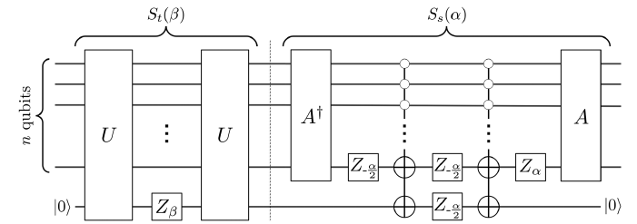

## Notes on Fixed Point Obvlious Amplitude Amplification

The statement of the amplitude amplification problem is as follows. We are given access to a state preparation unitary  $`A`$  such that  $`A\ket{0} = \ket{s}`$  and a state checking unitary  $`U`$  such that, for a target state  $`\ket{T}`$ ,  $`U\ket{v}\ket{0} = \ket{v}\ket{0 \oplus(v=T)}`$ . We are promised that  $`\ket{s}`$  has some overlap with  $`T`$ , specifically, 

```math
\braket{T|s} = \sqrt{\lambda}e^{i \omega}
```

for  $`\lambda > 0`$ . Given parameter  $`\delta`$ , the goal is to construct a circuit with complexity  $`L \in O(\log(1/\delta)/\sqrt{\lambda})`$ , denoted  $`S_L`$ , such that the probability of measuring  $`\ket{T}`$ , which we denote  $`P_L`$ , is given by 

```math
P_L = |\bra{T} S_L \ket{s}|^2 \ge 1-\delta^2.
```


A key issue in regular amplitude amplification is that  $`L' > L`$ , can lead to the souffle problem, where we overcook the state such that it reverts back to having low overlap with the target. To avoid this problem we either have to know  $`\delta`$  exactly or resort to trial and error techniques like expenonentially increasing the number of iterates. The promise of oblvious amplitude amplification is that there exists a circuit of (any cost)  $`L`$  such that


```math
P_L(\lambda) = 1-\delta^2 T_L(T_{1/L}(1/\delta)\sqrt{1-\lambda})^2
```

where  $`T_k`$  is the  $`k`$ -degree Chebyshev polynomial of the first kind satisfying  $`T_k(\cos(x)) = \cos(k x)`$ . We've now made explicit a dependence on  $`\lambda`$ . It turns out that if the above is achievable then we have that 
-  $`L \in O(\log(1/\delta)/\sqrt{\lambda})`$ ,  $`P_L(\lambda) \ge 1-\delta^2`$ , **and** 
- for  $`L'>L`$ ,  $`P_{L'}(\lambda) \ge 1-\delta^2`$ . 

We thus entirely avoid the souffle problem. The algorithm is oblvious because it doesn't need prior knowledge of  $`\delta`$ , rather, a lower bound suffices.

We first assume that we have access to such an  $`S_L`$ . We show that  $`P_L(\lambda)`$  satisfies the properties in the dot points. Note that the Chebyshev property ensures that so long as  $`|x| \le 1`$  then  $`|T_k(x)| \le 1`$ . Hence, as long  $`\sqrt{1-\lambda}|T_{1/L}(1/\delta)| \le 1`$  then  $`|T_L(T_{1/L}(1/\delta)\sqrt{1-\lambda})| \le 1`$  and therefore  $`P_L \ge 1-\delta^2`$ . Denoting  $`w = 1-T_{1/L}(1/\delta)^{-2}`$ , its clear that this happens if  $`\lambda \ge w`$ .

It turns out that for large  $`L`$  and small  $`\delta`$  we have that 

```math
w \approx \left(\frac{\log(2/\delta)}{L}\right)^2
```
 
and from the condition  $`\lambda \ge w`$  we have

```math
L \ge \frac{\log(2/\delta)}{\sqrt{\lambda}} \in O(\log(1/\delta)/\sqrt{\lambda})
```

completing the first claim. The second claim easily follows from the fact that as we continue to increase  $`L`$ ,  $`w`$  decreases and  $`\lambda \ge w`$  still holds. In fact the range of  $`\lambda`$ 's that are amplified by the circuit broadens to include smaller and smaller values. It is for this reason that the authors refer to  $`w`$  as the *width* of the algorithm, since it directly determines the range of viable  $`\lambda`$  values.


What remains is the harder problem of constructing  $`S_L`$ . First, for simplicity, define states 


```math
\ket{t} = e^{-i\omega}\ket{T}
```
 
and 

```math
\ket{t^\perp} = \frac{1}{\sqrt{1-\lambda}}(\ket{s} - \sqrt{\lambda}\ket{t})
```

So that we can write

```math
\ket{s} = 
\begin{pmatrix}
\sqrt{1-\lambda}\\
\sqrt{\lambda}
\end{pmatrix}
```

in the  $`\ket{t}, \ket{t^\perp}`$  basis. The goal will be to construct a generalised grover iterate which constructs the so-called Chebyshev state


```math
S_L\ket{s} = \ket{C_L} = \sqrt{1-P_L(\lambda)}\ket{t^\perp} + \sqrt{P_L(\lambda)}e^{i\chi}\ket{t}
```

for some relative phase  $`\chi`$ , up to a possible global phase.
To build a generalised Grover iterate we construct the following generalised reflections.


```math
S_s(\alpha) = I - (1-e^{-i\alpha})\ket{s}\bra{s}
```

and similarly,

```math
S_t(\beta) = I-(1-e^{-i \beta})\ket{t}\bra{t}.
```

Setting  $`\alpha = \pm \pi`$  and  $`\beta = \pm \pi`$  reduces  $`S_t`$  and  $`S_s`$  to the standard reflections seen in Grover's. Each reflection can be built in query complexity  $`O(1)`$  to the unitaries  $`A`$  and  $`U`$  and their adjoints respectively. \

The generalised Grover's iterate is thus


```math
G(\alpha, \beta) = -S_s(\alpha)S_t(\beta)
```


and we have 


```math
S_L = \left(\prod_{j=1}^l G(\alpha_j, \beta_j)\right)A
```


where  $`2l = L-1`$  ( $`L`$  must be odd since it counts the number of applications of  $`S_s, S_t`$  and  $`A`$ ),


```math
\alpha_j=-\beta_{l-j+1} = 2\cot^{-1}(\tan(2\pi/L)\sqrt{1-\gamma^2})
```


and  $`\gamma^{-1} = T_{1/L}(1/\delta)`$ . To prove this YLC define  $`\phi`$  such that  $`\sin(\phi/2) = \sqrt{\lambda}`$  and the following operators


```math
R_{\varphi}(\theta) = \exp \left(\frac{-i}{2} \theta \left[\cos \varphi Z + \sin \varphi X\right]\right)
```

and

```math
A_\omega = \exp\left(\frac{-i}{2}\phi \left[\cos \omega X + \sin \omega Y\right]\right).
```


Note we use these operators purely for analytical purposes so it won't be necessary to give them circuit implementations. I prove the following identities in the appendices.

```math
S_s(\alpha) = e^{-i\alpha/2} R_{\phi}(\alpha),\\
S_t(\alpha) = e^{i\beta/2}R_0(\beta),\\
A = A_{\pi/2},\\
R_\phi(\alpha) = A_{\pi/2}R_0(\alpha)A_{-\pi/2},\\
A_{\alpha + \beta} = R_0(\beta)A_\alpha R_0(-\beta).
```


It follows from the first four identities that:

```math
S_L = \left(\prod_{j=1}^l e^{-i(\alpha - \beta)/2} R_{\phi}(\alpha_j)R_0(\beta_j)\right)A_{\pi/2}\\
\sim \left(\prod_{j=1}^l A_{\pi/2}R_0(\alpha_j)A_{-\pi/2}R_0(\beta_j)\right)A_{\pi/2}.
```


Clearly, the number of  $`A_{\pm \pi/2}`$  operators is equal to  $`L`$ . Moreover the central operator is located in position  $`l+1`$ , is  $`A_{\pi/2}`$  if  $`l`$  is even and otherwise is  $`A_{-\pi/2}`$ . The goal is to get the above into the form

```math
R_0(\omega_1)(A_{\omega_L}A_{\omega_{L-1}}...A_{\omega_1})R_0(-\omega_1)
```


We'll consider the odd  $`l`$  case (the even is similar) where the above sequence is written


```math
...R_0(\beta_{k+1})A_{\pi/2}R_0(\alpha_{k})A_{-\pi/2}R_0(\beta_k)A_{\pi/2}R_0(\alpha_{k-1})...
```


where  $`k=(l+1)/2`$  centre angles. Because of the fact that  $`\alpha_j = \beta_{l-j+1}`$ ,  $`\alpha_k = -\beta_k`$  the above simplifies to 


```math
...R_0(-\alpha_{k-1})A_{\pi/2}R_0(\alpha_k)A_{-\pi/2}R_0(-\alpha_k)A_{\pi/2}R_0(\alpha_{k-1})...
```


We can then "push the angles out" to their nearest end of the sequence by exploiting the fifth identity. In what follows we do single step of the push in both the left and right direction.

```math
...R_0(-\alpha_{k-1})A_{\pi/2}R_0(\alpha_k)A_{-\pi/2}R_0(-\alpha_k)A_{\pi/2}R_0(\alpha_{k-1})...\\
=\\
...R_0(-\alpha_{k-1})R_0(\alpha_k)R_0(-\alpha_k)A_{\pi/2}R_0(\alpha_k)A_{-\pi/2}R_0(-\alpha_k)A_{\pi/2}R_0(\alpha_k)R_0(-\alpha_k)R_0(\alpha_{k-1})...\\
=\\
...R_0(-\alpha_{k+1}+\alpha_k)A_{\pi/2-\alpha_k}A_{-\pi/2}A_{\pi/2-\alpha_k}R(\alpha_{k-1}-\alpha_k)...
```


It's not too difficult to see that when we push the angles till the end, we get a sequence of the form, 


```math
S_L \sim R_0(\omega)(A_{\omega_L}A_{\omega_{L-1}}...A_{\omega_1})R_0(-{\omega})
```


where  $`\omega_{k+j} = \omega_{k-j}`$  for all  $`0\le j \le k-1`$  and

```math
\omega_{i+1} - \omega_{i} = (-1)^{i}\left(\pi - 2\cot^{-1}(\tan(2\pi i/L)\sqrt{1-\gamma^2})\right).
```


Now we consider the effect of  $`S_L`$  on the initial state  $`\ket{t^\perp} = (1, 0)^\top`$ , which is easily prepared by measuring  $`\ket{s}`$  in the  $`\ket{t^\perp}, \ket{t}`$  basis. Clearly,  $`R_0(\omega)`$  does nothing except to impart a global phase so its effect can be ignored. We now consider the effect of all the  $`A_{\omega_j}`$ s and we do so via the recurrence relation


```math
\begin{pmatrix}
a_j\\
b_j 
\end{pmatrix}
=
A_{\omega_{j}}
\begin{pmatrix}
a_{j-1}\\
b_{j-1}
\end{pmatrix}.\tag{1}
```

where  $`a_0 = 1, b_0 = 0`$ . Defining  $`x = \cos(\phi/2)`$ ,  $`A_{\omega_j}`$  can be written


```math
A_{\omega_j} = 
\begin{pmatrix}
x && -i\sqrt{1-x^2}e^{-i\omega_j}\\
-i\sqrt{1-x^2}e^{i\omega_j} && x
\end{pmatrix}
```


which leads to the equation.

```math
a_j = xa_{j-1}-ie^{-i\omega_j}\sqrt{1-x^2}b_{j-1}.
```

By rearranging equation 1 using  $`A^\daggerger_{\omega_j}`$  we find that

```math
a_{j-1} = xa_j+ie^{-i\omega_j}\sqrt{1-x^2}b_j\\
\implies
b_{j-1} = \frac{-i}{\sqrt{1-x^2}}e^{i\omega_{j-1}}(a_{j-2}-xa_{j-1})
```

and therefore


```math
a_j = (1+e^{-i(\omega_j - \omega_{j-1})})xa_{j-1} -e^{-i(\omega_j - \omega_{j-1})}a_{j-2} 
```


As we will soon show,  $`a_L = T_L(x/\gamma)/T_L(1/\gamma) = \delta T_L(T_{1/L}(1/\delta)\sqrt{1-\lambda^2})`$ . Since the probability of measuring  $`\ket{t}`$  is  $`1- a_L^2`$  and since the final  $`R_0(\omega)`$  doesn't effect this measurement probability, we've successfully found a satisficing  $`S_L`$  for fixed point oblivious amplitude amplification.

But before we celebrate, we should first show that  $`a_L`$  does indeed have the above characterisation. Recall that  $`a_j`$  satisfies the recurrence


```math
\begin{align*}
a_0(x) &= 1\\
a_1(x) &= x\\
a_j(x) &= (1+e^{-i(\omega_j - \omega_{j-1})})xa_{j-1} -e^{-i(\omega_j - \omega_{j-1})}a_{j-2} 
\end{align*}
```

which looks very similar to the Chebyshev polynomial recurrence

```math
\begin{align*}
T_0(x) &= 1\\
T_1(x) &= x\\
T_j(x) &= 2xT_{j-1}(x) - T_{j-2}(x).
\end{align*}
```


Indeed our recurrence generalises the Chebyshev polynomial since the two are equal when  $`\omega_j - \omega_{j-1} = 0 \implies \gamma = \delta = 1`$ .